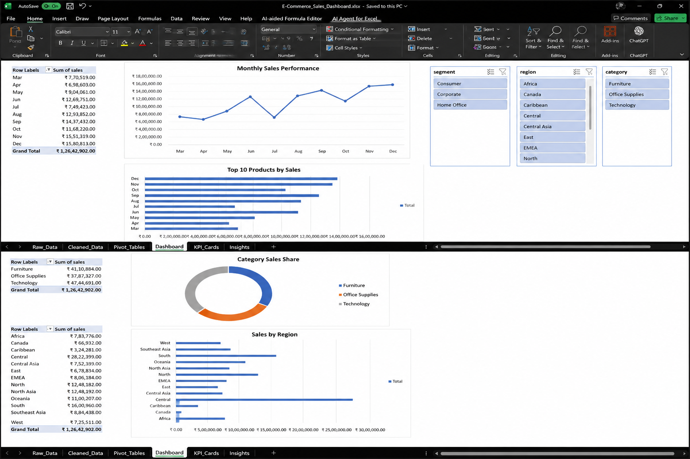
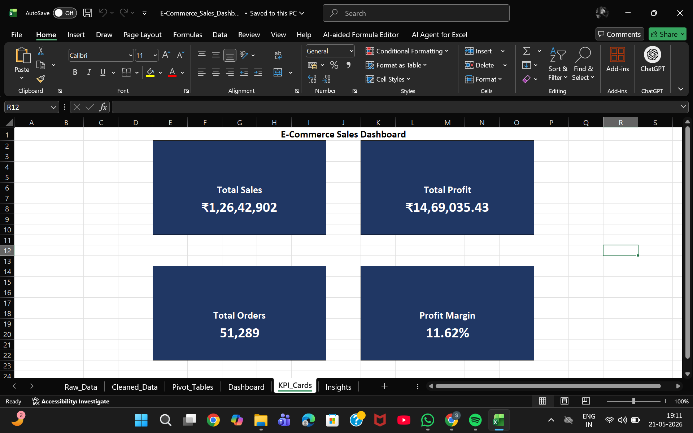
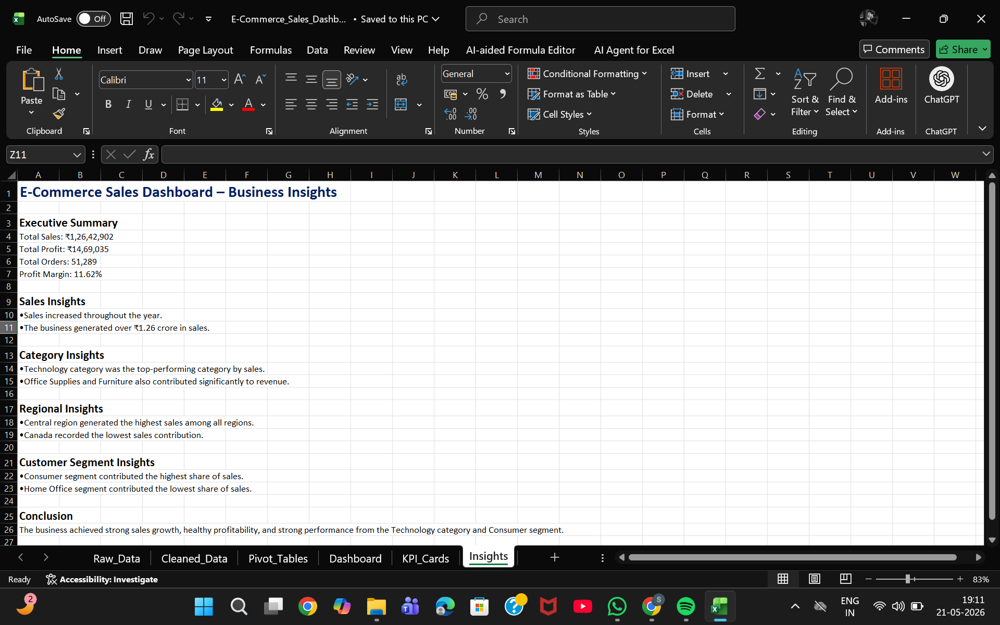

# E-Commerce Sales Dashboard

## Project Overview

This project is an interactive Excel dashboard built using Pivot Tables, Pivot Charts, KPI Cards, Slicers, and Business Insights.

## Features

- Total Sales KPI
- Total Profit KPI
- Total Orders KPI
- Profit Margin KPI
- Monthly Sales Trend Analysis
- Product-wise Sales Analysis
- Region-wise Sales Analysis
- Interactive Slicers
- Business Insights Report

## Tools Used

- Microsoft Excel
- Pivot Tables
- Pivot Charts
- Slicers
- Conditional Formatting
- Dashboard Design

## Project Files

- E-Commerce_Sales_Dashboard.xlsx
- Dashboard.png
- KPI_Cards.png
- Insights.png

## Business Summary

- Total Sales: ₹1,26,42,902
- Total Profit: ₹14,69,035
- Total Orders: 51,289
- Profit Margin: 11.62%

## Key Insights

- Sales showed positive growth throughout the year.
- Technology category generated the highest sales.
- Consumer segment contributed the largest share of revenue.
- Central region recorded the highest sales performance.
- The business maintained a healthy profit margin of 11.62%.

## Dashboard Preview

### Dashboard

### KPI Cards

### Business Insights

## Author

Sri Lakshmi

Aspiring Data Analyst | Excel Dashboard Developer
